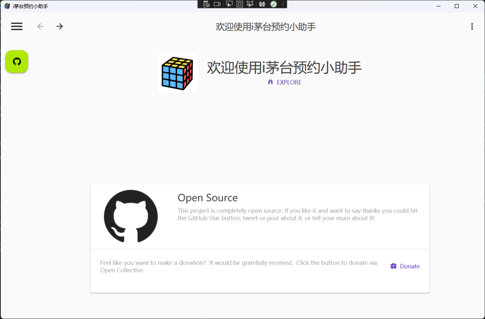
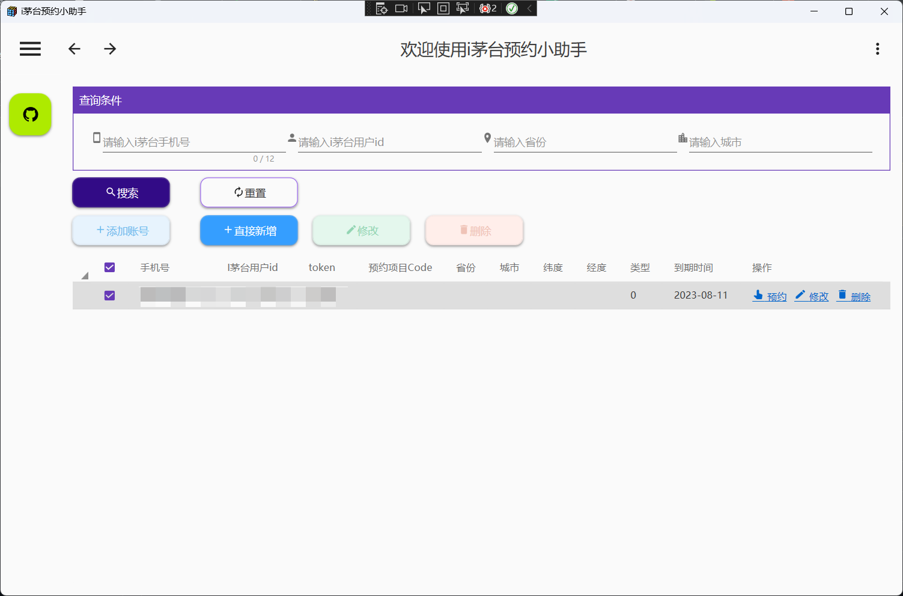
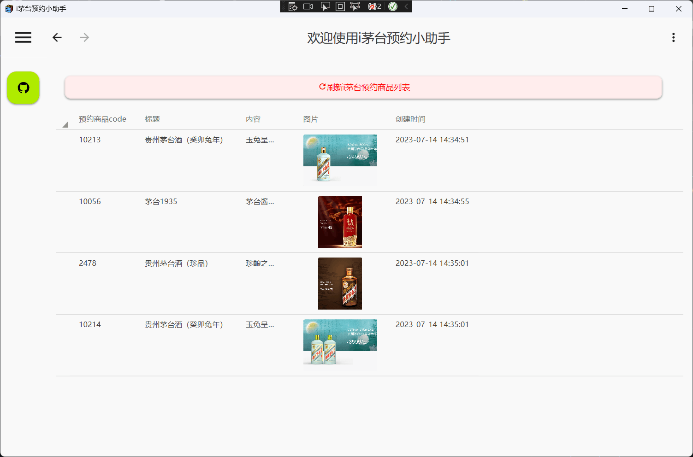
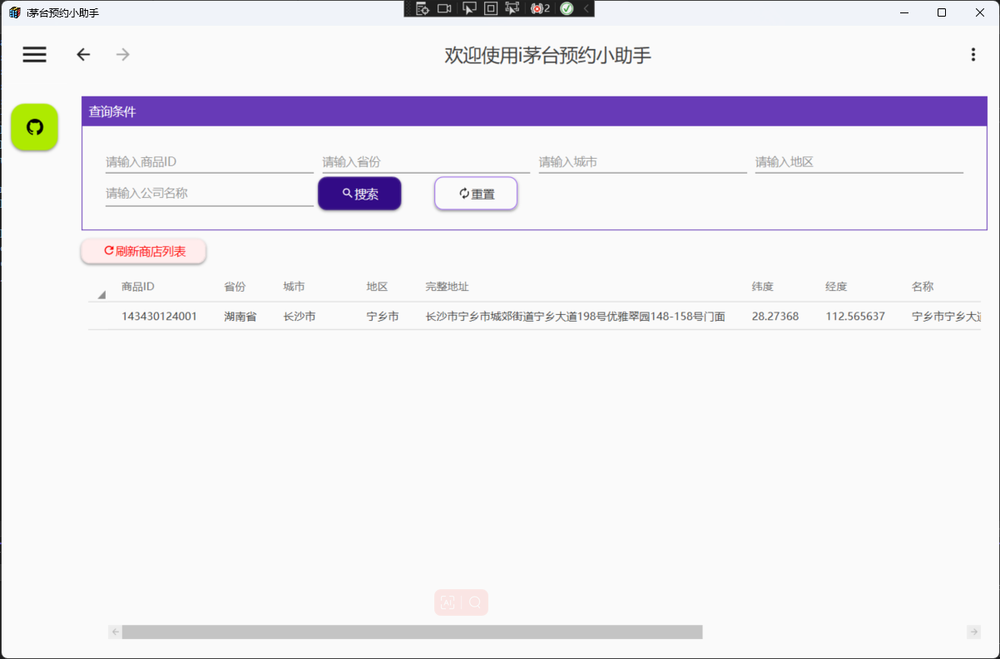
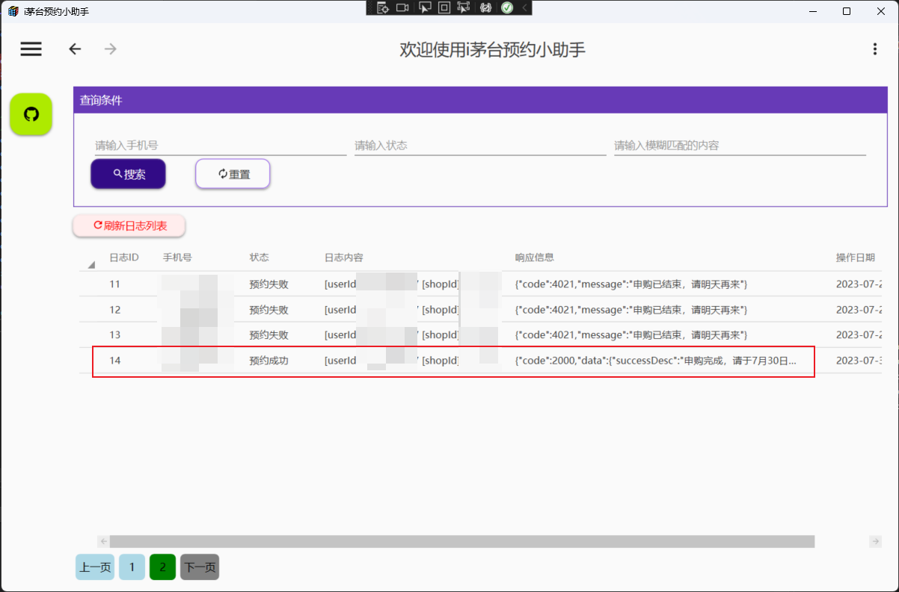

    

  
	
    
    

Wpf实现i茅台app接口自动化每日自动预约

<h2 align="center">hygge-imaotai</h2>

	<a href="https://github.com/lisongkun?tab=repositories">『 All open source projects 』</a>
	<a href="https://www.lisok.cn/">『 Personal blog 』</a>

## 项目介绍
通过接口自动化模拟i茅台app实现每日自动预约茅台酒的功能,可添加多用户,选择本市出货量最大的门店,或预约你的位置附近门店

软件会在指定时间开始对管理的用户进行批量预约。

本程序是对该项目(**SpringBoot使用Docker部署版本**:[https://github.com/oddfar/campus-imaotai](https://github.com/oddfar/campus-imaotai))的WPF客户端实现

## 演示图
| i茅台预约                           |                                         |
| ----------------------------------- | --------------------------------------- |
|  |  |
|                                     |                                         |
|        |    |
|        |    |

## 贡献代码

若您有好的想法，发现一些 **BUG** 并修复了，欢迎提交 **Pull Request** 参与开源贡献

发起 pull request 请求，提交到 master 分支，等待作者合并

## Star历史

## 鸣谢
### 感谢以下组织机构提供开源许可

    
    

